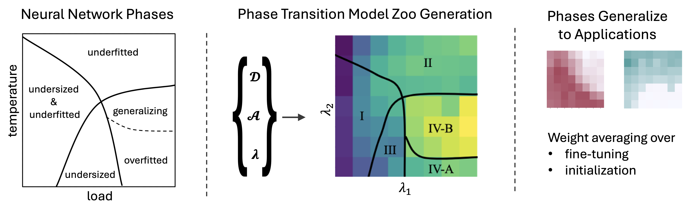
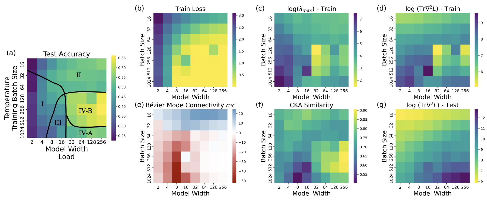
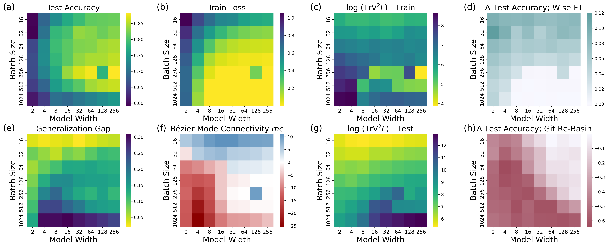

# Supplemantary Material To Phase Transition Model Zoos




Dear Reviewers,

In this repository, we provide full code to reproduce thetraining, evaluation and loss-landscape metrics computation of the model zoos proposed in our submission. We also provide a notebook to reproduce the figures in the paper visualizing the different phases, similar to the phases visualized in the Figure below. 



This repository contains three code sections:
```
- src
- scripts
- visualize_phases.ipynb
```

 `src`, `scripts` and a notebook `visualize_phases.ipynb` to visualize and explore the dataset. We expand on these three sections in the following.

Please also note the supplementary material pdf `supplementary_materials.pdf` which includes the dataset documentation, author statements, and hosting plans. 

## Code
 
### Model Defintions

In `src`, we collect model definitions, trainer code, loss-landscape and model averaging code. Model definitions and runners are in `src/ptmz/models/`. Here, `def_resnet_width.py` contains the ResNet model class and training steps. `def_NN_experiment.py` contains code to run experiments over grids using [ray.tune](https://docs.ray.io/en/latest/tune/index.html).  
```
- src
    - ptmz
        - models
            - ...
        - loss_landscape
            - ...
        - model_averaging
            - ...
```

### Loss Landscape Metrics
The loss landscape metrics are collected in `src/ptmz/loss_landscape/`. We include code to compute the hessian metrics and ray experiment in `hessian_metric.py` and `hessian_experiment.py`, with dependencies on `src/ptmz/loss_landscape/pyhessian`. The CKA implementation is likewise in `CKA.py` and `CKA_experiment.py` with dependencies on `CKA_utils.py`. Similarly, Bezier mode connectivity is implemented in `curve_fitting.py` and `curve_fitting_experiment.py` with utils in `curves.py`.

### Phase Identification In Applications - Model Averaging
Code to evaluate phases in model averaging is in `src/ptmz/model_averaging/`. Averaging one model over different training epochs is implemented in `average_model_epochs.py` and `average_model_epochs_experiment.py`. Averaging over different seeds is in `average_models.py` and `average_model_experiment.py`, with additional model aligenment in `align_models.py`.

[TODO](): should we discuss the pyhessian stuff somewhere / give reference to where that comes from?

## Experiment replication
We include all code to reproduce our experiments and re-train or extend our model zoos, as well as to re-compute the loss-landscape metrics.
The experiment runner files can be fonud in `scripts` with one sub-directory per zoo. Within each subdirectory, you will find experiment runners to train the zoos, e.g.,`train_zoo_cifar10_resnet18_wide.py`, but also experiment runners to compute the loss landscape metrics and model averaging experiments.  
To train the zoos, one has to adapt the paths to the local file structure, configure available GPUS, and then run   
> `python3 train_zoo_cifar10_resnet18_wide.py`   

This will configure the experiment space and run all experiments on the temperature-load grid with seed repetitions using [ray.tune](https://docs.ray.io/en/latest/tune/index.html). The experiments to compute loss-landscape metrics are run in a similar fashion. These require only the path to an existing trained population.

## Visualization of Phases
This repository also contains code to reproduce figures from the submission. The jupyter notebook `visalize_phases.ipynb` contains code to download dataset samples, extract the performance and loss landscape metrics, and visualize them on the temperature-load surface like the figure below. Within the notebook, we also give examples how to instantiate the models and load checkpoints. 



## Dataset Samples
Two zoo samples, one ResNet18 and ResNet50 zoo can be found [here](https://drive.proton.me/urls/TG5WC7B43C#bkNzPBKq1EWx). Please download the `zip` files, and extract them to `data`.

<!-- To download them, run   
> download_data.sh  

This will download and extract two sample model zoos with a subset of epochs and loss landscape metrics. The sample datasets are stored in `./data/`.  -->
Please note that the dataset format is restricted at this point to facilitate double blind reviewing. 
We purposefully leave the dataset relatively raw, since we do not want to restrict use cases. For the camera ready version, we will provide code to make the dataset accessible for the use-cases we can envision. We welcome feedback on how best to present these datasets.

### Dataset Directory Structure and Information 
Each of the dataset examples contains 192 models (8x8x3) in one directory per model. As outlined below, each model directory contains the config of that particular model in `params.json` as well as the model performance metrics in `result.json`. We have annotated loss landscape metrics for some epochs in the `result.json`. Further, we have included a small subset of checkpoints per model in their corresponding subdirectories. With the code in this repository, the config and the checkpoints, models can be loaded and used to reproduce our results exactly. Examples for that can be found in the notebook.

```
- data
    - cifar_10-ResNet18_subset
        - model 1
            - checkpoint_000XYZ
            - config.json
            - result.json
            - ...
        - ...
    - cifar_100-ResNet50_subset
        - model 1
            - checkpoint_000XYZ
            - config.json
            - result.json
            - ...
        - ...
```

#