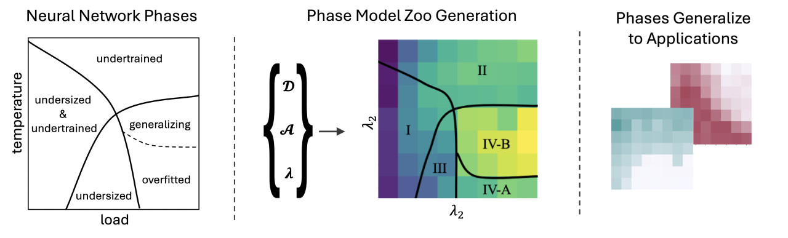
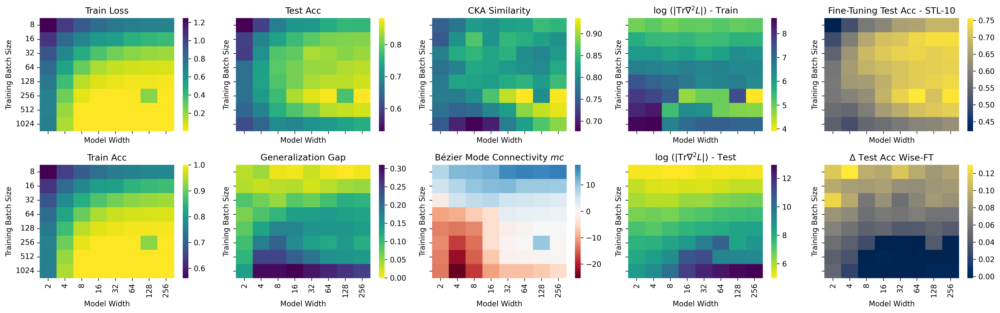

# A Model Zoo on Phase Transitions in Neural Networks

This repository contains the code and resources needed to access and work with the dataset to be published in the **Journal of Data-centric Machine Learning Research (DMLR)**. Our **Phase Transitions Model Zoo** dataset includes 12 large-scale model zoos systematically covering known loss landscape phases across architectures, datasets and modalities (vision, NLP, scientific ML). In the following, we introduce the code used to generate the zoos and compute its loss landscape metrics, and present the different ways you can access and work with the dataset.



## Paper

Pending publication, we kindly refer the reader to the workshop version of our work, available as a pre-print on [arXiv](https://arxiv.org/abs/2504.18072).

## Phase Transitions in Neural Networks

Yang *et al.* [[1](#references)] have developped a taxonomy of neural network (NN) loss landscapes, inspired by statistical mechanics, to define distinct phases and phase transitions in NN parameter space. These phases, characterized by qualitative changes in generalization performance, are influenced by hyperparameters such as model size, data noise, and training iterations, analogous to physical systems. This framework categorizes NN behavior using two axes: temperature and load. "Temperature" reflects training noisiness, while "load" denotes the data-to-model size ratio. The loss landscape is analyzed using metrics such as training loss, local sharpness (via Hessian-based measures), global niceness (mode connectivity), and representation similarity (CKA). These metrics reveal phases in the hyperparameter space, each defined by unique combinations of training loss, sharpness, connectivity, and representation consistency, providing insights into model generalization and optimization dynamics. We invite the interested reader to find more detailed descriptions of the phases in our [paper](#paper) or directly the work of Yang *et al.* [[1](#references)].


   Phase                | Train Loss | Hessian Metrics | Mode Connectivity | CKA Similarity |
 |----------------------|------------|-----------------|-------------------|----------------|
 | **Phase I** (underfitted & undersized) | High         | Large (rugged basin) | Negative (barrier)       | —              |
 | **Phase II** (underfitted)             | High         | Large               | Positive                  | —              |
 | **Phase III** (undersized)             | Small        | Small (smooth basin) | Negative                  | —              |
 | **Phase IV-A** (overfitted)            | Small        | Small               | Near-zero   (no barrier)               | Small (dissimilar)          |
 | **Phase IV-B** (generalizing)         | Small        | Small               | Near-zero    | Large (similar)         |

## Dataset Access

[![CC BY 4.0][cc-by-shield]][cc-by]

The **Phase Transitions Model Zoo** dataset is licensed under a
[Creative Commons Attribution 4.0 International License][cc-by].

[cc-by]: http://creativecommons.org/licenses/by/4.0/
[cc-by-shield]: https://img.shields.io/badge/License-CC%20BY%204.0-lightgrey.svg

We are currently in the process of making the dataset as a whole available. In the meantime, two zoo samples, one ResNet18 and ResNet50 zoo can be found [here](https://drive.proton.me/urls/V2E66KY0JM#Pq5M06URN4EN). Please download the `zip` files, and extract them to `data`.

### Dataset Directory Structure and Information

Each of the dataset samples contains 192 models (8x8x3) in one directory per model. As outlined below, each model directory contains the config of that particular model in `params.json` as well as the model performance metrics in `result.json`. We have annotated loss landscape metrics for some epochs in the `result.json`. Further, we have included a small subset of checkpoints per model in their corresponding subdirectories. With the code in this repository, the config and the checkpoints, models can be loaded and used to reproduce our results exactly. Examples for that can be found in the notebook.

```
- data
    - cifar_10-ResNet18_subset
        - model 1
            - checkpoint_000XYZ
            - config.json
            - result.json
            - ...
        - ...
    - cifar_100-ResNet50_subset
        - model 1
            - checkpoint_000XYZ
            - config.json
            - result.json
            - ...
        - ...
```

### Dataset Contents

Our dataset contains 12 model zoos covering all phases. The zoos include computer vision, natural language and scientific machine learning (SciML) models, with different architectures of different sizes and are trained on various datasets. It contains a total of $\sim2\,500$ unique neural network models between 11K and 900M parameters and more than 60k checkpoints. We provide more comprehensive details about the zoos and the configurations used to generate them in our [paper](#paper). Below, we provide a summary of the contents of the dataset:

Architecture | Dataset       | # models | Load-like hyperparameter | Temperature-like hyperparameter
|------------|---------------|----------|--------------------------|--------------------------------|
ResNet-18    | SVHN          | 192      | Model width              | Batch size
ResNet-18    | CIFAR-10      | 192      | Model width              | Batch size
ResNet-18    | CIFAR-100     | 192      | Model width              | Batch size
ResNet-18    | TinyImagenet  | 192      | Model width              | Batch size
ResNet-50    | SVHN          | 192      | Model width              | Batch size
ResNet-50    | CIFAR-10      | 192      | Model width              | Batch size
ResNet-50    | CIFAR-100     | 192      | Model width              | Batch size
ResNet-50    | TinyImagenet  | 192      | Model width              | Batch size
ViT          | CIFAR-10      | 147      | Model width              | Batch size
ViT          | CIFAR-100     | 147      | Model width              | Batch size
GPT-2        | OpenWebText   | 264      | `model_dim`              | Batch size
MLP (PINN)   | 1D Convection | 700      | Convection coeff. `beta` | Learning rate

## Code

This repository contains three code sections:
```
- src
- scripts
- visualize_phases.ipynb
```

`src`, `scripts` and a notebook `visualize_phases.ipynb` to visualize and explore the dataset. We expand on these three sections in the following.
 
### Model Defintions

In `src`, we collect model definitions, trainer code, loss-landscape and model averaging code. Model definitions and runners are in `src/ptmz/models/`. Here, `def_resnet_width.py` contains the ResNet model class and training steps. `def_NN_experiment.py` contains code to run experiments over grids using [ray.tune](https://docs.ray.io/en/latest/tune/index.html).  
```
- src
    - ptmz
        - models
            - ...
        - loss_landscape
            - ...
        - model_averaging
            - ...
```

### Loss Landscape Metrics
The loss landscape metrics are collected in `src/ptmz/loss_landscape/`. We include code to compute the hessian metrics and ray experiment in `hessian_metric.py` and `hessian_experiment.py`, with dependencies on `src/ptmz/loss_landscape/pyhessian`. The CKA implementation is likewise in `CKA.py` and `CKA_experiment.py` with dependencies on `CKA_utils.py`. Similarly, Bezier mode connectivity is implemented in `curve_fitting.py` and `curve_fitting_experiment.py` with utils in `curves.py`.

### Phase Identification In Applications - Model Averaging
Code to evaluate phases in model averaging is in `src/ptmz/model_averaging/`. Averaging one model over different training epochs is implemented in `average_model_epochs.py` and `average_model_epochs_experiment.py`. Averaging over different seeds is in `average_models.py` and `average_model_experiment.py`, with additional model aligenment in `align_models.py`.

### Experiment replication
We include all code to reproduce our experiments and re-train or extend our model zoos, as well as to re-compute the loss-landscape metrics.
The experiment runner files can be fonud in `scripts` with one sub-directory per zoo. Within each subdirectory, you will find experiment runners to train the zoos, e.g.,`train_zoo_cifar10_resnet18_wide.py`, but also experiment runners to compute the loss landscape metrics and model averaging experiments.  
To train the zoos, one has to adapt the paths to the local file structure, configure available GPUS, and then run   
> `python3 train_zoo_cifar10_resnet18_wide.py`   

This will configure the experiment space and run all experiments on the temperature-load grid with seed repetitions using [ray.tune](https://docs.ray.io/en/latest/tune/index.html). The experiments to compute loss-landscape metrics are run in a similar fashion. These require only the path to an existing trained population.

### Visualization of Phases
This repository also contains code to reproduce figures from the submission. The jupyter notebook `visalize_phases.ipynb` contains code to download dataset samples, extract the performance and loss landscape metrics, and visualize them on the temperature-load surface like the figure below. Within the notebook, we also give examples how to instantiate the models and load checkpoints. 



## References

[1] Yang, Y., Hodgkinson, L., Theisen, R., Zou, J., Gonzalez, J. E., Ramchandran, K., & Mahoney, M. W. (2021). Taxonomizing local versus global structure in neural network loss landscapes. *Advances in Neural Information Processing Systems, 34*, 18722-18733. ([link](https://proceedings.neurips.cc/paper/2021/hash/9b72e31dac81715466cd580a448cf823-Abstract.html))

## See also

* The original [model zoos](https://www.modelzoos.cc) dataset, which contains other zoos of Deep Learning models, mostly CNNs and ResNet-18 trained on computer vision classification tasks.